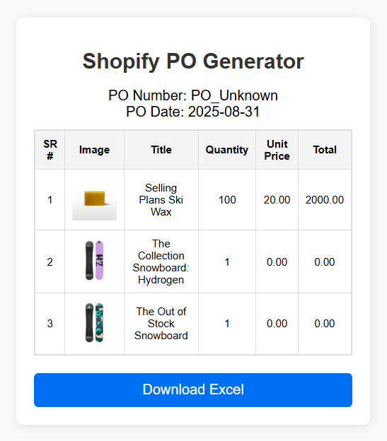
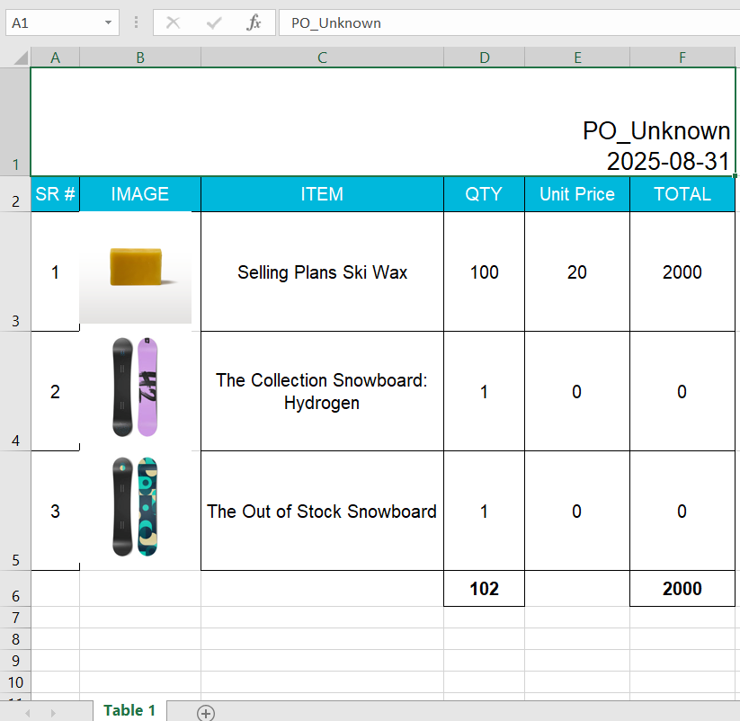

# Shopify PO Generator 📊

A Chrome extension for **internal use** that extracts purchase order data from Shopify admin pages and generates Excel spreadsheets. This tool works specifically with **draft purchase orders** for workflow automation.

## ⚠️ Important Limitations

- **Draft POs Only** - Extension only works with purchase orders in **draft status**
- **Manual Installation Required** - Not available on Chrome Web Store due to Shopify's data extraction policies
- **Internal Use Only** - Designed for personal/team productivity, not public distribution
- **Shopify Policy Compliance** - Use responsibly within Shopify's terms of service

## 🚀 Features

- **Draft PO Detection** - Extracts purchase order numbers and estimated arrival dates from draft POs
- **Product Data Extraction** - Collects item details, quantities, unit prices, and images
- **Live Preview** - Shows extracted data in a popup table before download
- **Excel Generation** - Creates formatted spreadsheets with:
  - Embedded product images
  - Calculated totals and formulas
  - Professional styling and borders
  - Proper column widths and row heights
- **One-Click Download** - Download ready-to-use Excel files instantly

## 📸 Screenshots

### Extension Popup (Draft PO)


### Generated Excel Output


## 🛠️ Installation

### Manual Installation (Developer Mode Only)

1. **Download the Extension**
   ```bash
   git clone https://github.com/yourusername/shopify-po-generator.git
   cd shopify-po-generator
   ```

2. **Enable Developer Mode in Chrome**
   - Open Chrome and go to `chrome://extensions/`
   - Toggle "Developer mode" in the top right corner

3. **Load the Extension**
   - Click "Load unpacked"
   - Select the downloaded `shopify-po-generator` folder
   - The extension will appear in your Chrome toolbar

## 📋 Usage

### Prerequisites
- Shopify admin access
- Purchase orders in **draft status** only
- Chrome browser with developer mode enabled

### Steps
1. **Navigate to Draft PO Page**
   - Log into your Shopify admin
   - Go to a Purchase Order that is in **DRAFT** status
   - ⚠️ **Will not work with confirmed/finalized POs**

2. **Click the Extension Icon**
   - The extension will attempt to detect PO information
   - Product data will be extracted and displayed in a preview table
   - If PO is not in draft status, extraction may fail

3. **Download Excel File**
   - Review the extracted data in the popup
   - Click "Download Excel" to generate your spreadsheet
   - File will be saved as `[PO_NUMBER].xlsx`

## 🔧 Technical Details

### Built With
- **Manifest V3** - Latest Chrome extension standard
- **ExcelJS** - Advanced Excel file generation with image support
- **Vanilla JavaScript** - No external frameworks for optimal performance
- **CSS3** - Modern styling with animations and responsive design

### Compatibility
- **Chrome**: Version 88+ (Manifest V3 support required)
- **Shopify**: Works with draft purchase orders only
- **Excel**: Compatible with Excel 2016+, Google Sheets, and LibreOffice Calc

### Known Issues
- ❌ **Does not work with confirmed/finalized POs**
- ❌ **Limited to draft status purchase orders**
- ⚠️ **May break if Shopify changes their admin interface**
- ⚠️ **Shopify may block similar functionality in the future**

## 🔒 Privacy & Security

- **No Data Collection** - Extension works entirely locally
- **No External Servers** - All processing happens in your browser
- **Shopify Only** - Extension only activates on Shopify admin pages
- **Draft POs Only** - Limited scope reduces security concerns

## 🐛 Troubleshooting

### Common Issues

**"No data extracted" error:**
- ✅ Ensure you're on a **DRAFT** purchase order page
- ❌ Extension will not work with confirmed/finalized POs
- 🔄 Try refreshing the page

**Extension doesn't appear:**
- Verify you're on a Shopify Purchase Order page
- Check that the PO is in draft status
- Ensure extension is enabled in Chrome

**Excel file won't download:**
- Check if popup blockers are disabled
- Ensure you have download permissions enabled
- Verify there's extractable data in the preview table

## ⚖️ Legal & Compliance

### Shopify Policy Considerations
- This tool extracts data from Shopify admin pages
- Use responsibly within your organization
- Ensure compliance with Shopify's Terms of Service
- Not suitable for public distribution due to policy restrictions

### Recommended Usage
- **Internal team productivity** ✅
- **Draft PO workflow automation** ✅
- **Personal Shopify store management** ✅
- **Public distribution** ❌
- **Chrome Web Store submission** ❌

## 🤝 Contributing

This project is for internal/personal use. Contributions should focus on:
- Improving draft PO detection reliability
- Enhancing Excel formatting options
- Adding error handling for edge cases
- Documentation improvements

### Development Notes
- Test only with draft purchase orders
- Be aware that Shopify interface changes may break functionality
- Consider Shopify's policies when making modifications

## 📝 License

This project is licensed under the MIT License - see the [LICENSE](LICENSE) file for details.

**Note**: This license covers the code only. Usage must still comply with Shopify's Terms of Service.

## ⚠️ Disclaimer

- **Educational/Internal Use**: This extension is intended for learning and internal productivity
- **No Warranty**: Use at your own risk - Shopify may change their interface at any time
- **Policy Compliance**: Users are responsible for ensuring compliance with Shopify's policies
- **Draft Only**: Functionality limited to draft purchase orders by design

## 📧 Support

For technical issues:
- Open an issue on GitHub with detailed information
- Include screenshots of the draft PO page where issues occur
- Specify your Shopify admin interface version if known

---

**Made for internal productivity - Use responsibly within Shopify's guidelines** ⚙️
